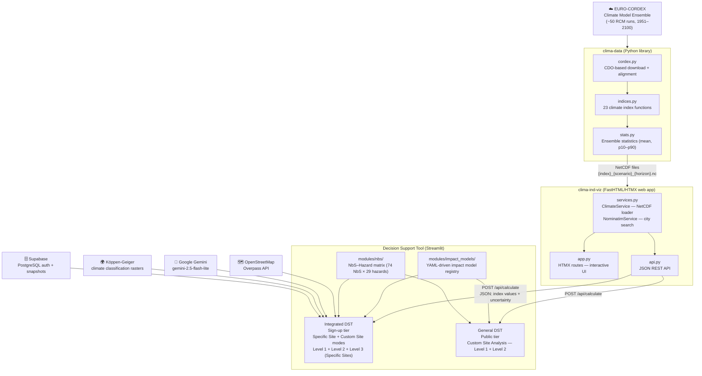

# Platform Architecture Overview

## Component diagram

The NATURE-DEMO platform is composed of three cooperating components. Data flows from raw CORDEX model outputs through progressively higher-level services until it reaches the user-facing DST:

---

## Component responsibilities

### clima-data

- **Role**: Offline CORDEX data processing pipeline
- **Inputs**: Raw CORDEX NetCDF files from ESGF / Copernicus CDS
- **Outputs**: 23 pre-computed climate index files per scenario × time horizon
- **Technology**: Python, xarray, xclim, CDO
- **Repository**: [github.com/NATURE-DEMO/clima-data](https://github.com/NATURE-DEMO/clima-data)
- **Documentation**: [nature-demo.github.io/clima-data](https://nature-demo.github.io/clima-data)

### clima-ind-viz

- **Role**: Climate data server — interactive UI + JSON API
- **Inputs**: NetCDF files produced by clima-data
- **Outputs**: Per-location climate index values with ensemble uncertainty (JSON)
- **Technology**: FastHTML, HTMX, xarray, Plotly, Folium
- **Deployment**: Modal containers at `naturedemo-clima-ind.dic-cloudmate.eu`
- **Repository**: [github.com/NATURE-DEMO/clima-ind-viz](https://github.com/NATURE-DEMO/clima-ind-viz)

### Decision Support Tool (this deliverable)

- **Role**: User-facing risk assessment and NbS decision support platform
- **Access tiers** (both reachable from the application landing page):
    - **Integrated DST** — sign-up required; full feature set including the pre-configured demonstrator-site configurations and the Custom Site Analysis workflow.
    - **General DST** — public, no sign-up required; Custom Site Analysis for any European location.
- **Inputs**: Climate index values (from clima-ind-viz API), user-provided asset and financial data
- **Outputs**: PRI heat maps, MCA-ranked NbS, RPRI comparison, AI-generated context reports
- **Technology**: Streamlit 1.50+, Leafmap, Plotly, Google Gemini, Supabase
- **Repository**: [github.com/NATURE-DEMO/Decision_Support_Tool](https://github.com/NATURE-DEMO/Decision_Support_Tool)
- **Production URL**: [nature-demo-dst.dic-cloudmate.eu](https://nature-demo-dst.dic-cloudmate.eu)

---

## External data sources

| Source | Purpose | Access |
|--------|---------|--------|
| OpenStreetMap (Overpass API) | CI asset extraction within user-drawn polygon | Public REST API |
| Nominatim (OSM geocoding) | City name → coordinates | Public REST API |
| Köppen-Geiger rasters | Local climate zone classification | Local rasters in `Koppen/` |
| Google Gemini (`gemini-2.5-flash-lite`) | AI-generated contextual risk narratives | `GEMINI_API_KEY` env var or `st.secrets["GEMINI_API_KEY"]` |
| Supabase (PostgreSQL) | User authentication, role management, analysis snapshot storage | Project URL and key via env vars |

---

## Session state and data flow within the DST

The DST uses **Streamlit session state** to thread data across workflow steps within a session. The Integrated DST persists analysis results beyond the session using **Supabase snapshots** (Level 1 and Level 2 states saved and loaded as JSON). Static data from `modules/impact_models/` and `modules/nbs/` is read-only and shared across all analysis steps.

---

## Security and privacy

- User authentication and analysis snapshots are stored in Supabase (PostgreSQL); credentials are never committed to the repository
- No sensitive personal data beyond account credentials is collected or stored by the DST
- All geographic queries are sent to public APIs (OSM, Nominatim)
- AI features use the Google Gemini API; API keys are never committed to the repository
- AI outputs are wrapped with disclosure headers/footers (`render_ai_header()` / `render_ai_footer()`)
