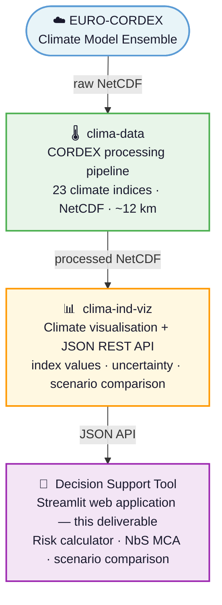

# NATURE-DEMO Decision Support Tool

**Deliverable D2.3** | EU Horizon Europe | Grant Agreement No. 101157448

---

## About this deliverable

This document describes the **NATURE-DEMO Decision Support Tool (DST)**, delivered as part of Work Package 2 (WP2) of the NATURE-DEMO project. The DST is an interactive web platform that guides infrastructure owners and planners through a structured climate risk assessment and supports the selection of **Nature-Based Solutions (NbS)** for climate adaptation.

The tool implements the three-level risk assessment methodology defined in **Deliverable D2.1** (Risk Assessment Framework) and operationalises it through an accessible web interface powered by EURO-CORDEX climate projections.

| | |
|---|---|
| **Project** | NATURE-DEMO — Nature-Based Solutions for Demonstrating Climate-Resilient Critical Infrastructure |
| **Grant Agreement** | No. 101157448 — EU Horizon Europe |
| **Deliverable** | D2.3 — Decision Support Tool |
| **Type** | Demonstrator / Software |
| **Dissemination level** | Public (PU) |
| **Lead beneficiary** | IBM |
| **Task leader** | University of Rostock (UROS) |
| **Authors** | F. Arabameri, J. Plönnigs, P. Spyridis, J. Jafari-Asl, H. Akçay (UROS) |
| **Due / Delivery date** | 30 April 2026 |

---

!!! tip "Live deployment"
    The Integrated DST is publicly accessible at **[nature-demo-dst.dic-cloudmate.eu](https://nature-demo-dst.dic-cloudmate.eu)**. A user account is required — contact the NATURE-DEMO consortium or create one via the sign-up form on the application.

!!! info "📄 Full deliverable manual"
    The D2.3 manual is also available as a single downloadable PDF: **[Download D2.3 — Decision Support Tool (PDF)](assets/D2.3_DST.pdf)** (≈ 16 MB, 63 pages). This is the canonical archived form of the deliverable, on which the content of this website is based.

---

## Scope

The DST covers **twelve classes of European critical infrastructure (CI)**:

| Sector | CI types |
|--------|----------|
| **Transportation** | Roads, Railways, Bridges, Tunnels |
| **Water Management** | Dams, River training, Torrent control, Water infrastructure |
| **Urban Infrastructure** | Green spaces, Buildings, Industrial buildings |
| **Energy** | Energy infrastructures |

For each CI type the tool:

1. Characterises the **climate hazard context** of the asset location using EURO-CORDEX indices
2. Computes the **Potential Risk Index** (PRI = HI × EI × VI) — a semi-quantitative score per asset, impact type, and climate scenario
3. Ranks applicable **Nature-Based Solutions** from the D1.1 catalogue using a five-criteria Multi-Criteria Analysis (MCA)
4. Calculates the **Residual Potential Risk Index** (RPRI) after applying selected adaptation measures

---

## Key objectives

- Provide infrastructure managers with an **accessible, evidence-based** tool for Level 2 climate risk pre-screening
- Operationalise the **D2.1 semi-quantitative methodology** (PRI = HI × EI × VI) across twelve CI types, covering the eight CI sectors identified in D2.1 and additional categories
- Enable **NbS vs. grey infrastructure** comparison through MCA-ranked adaptation options
- Deliver **climate data** drawn from EURO-CORDEX ensembles (23 indices, RCP4.5/8.5, three future horizons) via a dedicated API
- Support the **five NATURE-DEMO demonstration sites** in Austria, Romania, Slovenia, Slovakia and North Macedonia, exposed as six pre-configured site configurations (the Austrian demonstrator is split into Lattenbach and Brunntal)

---

## Platform components

The DST is the top layer of a three-component platform:

For a detailed description of each component and their integration see the [Architecture overview](architecture/overview.md).

---

## Document structure

| Section | Content |
|---------|---------|
| [Methodology](methodology/framework.md) | Theoretical framework (D2.1), three-level risk assessment |
| [User Guide](user_guide/integrated_dst.md) | Step-by-step workflows for each application mode |
| [Architecture](architecture/overview.md) | Platform design, API integration, data models |
| [Deployment](deployment.md) | Installation and deployment instructions |
| [Bibliography](bibliography.md) | References and data sources |
| [Acknowledgments](acknowledgments.md) | Funding and attribution |

---

## Delivered features

| Feature | Notes |
|---------|-------|
| **clima-data pipeline** | 23 climate indices from EURO-CORDEX ensembles; RCP4.5/8.5; 1951–2100; deployed at `naturedemo-clima-ind.dic-cloudmate.eu` |
| **Decision Support Tool** | Authentication-gated web application; six demo site configurations; Custom Site Analysis for any European location |
| **Level 1 — Qualitative risk perception** | Stakeholder KPI scoring (RAMS SHEEP); multi-expert live consensus; SSF/SEI NbS filtration and feasibility ranking |
| **Level 2 — Semi-quantitative screening** | 7-step PRI = HI × EI × VI workflow; NbS MCA ranking; RPRI residual risk comparison |
| **Level 3 — High-resolution assessment** | Viewer integrated for all six site configurations; renders partner-supplied site-specific assessments, data tables, and reports from the GitHub content system. Depth of available material varies by demonstrator. |
| **NbS–Hazard matrix** | 74 NbS types × 29 hazards from the D1.1 catalogue; primary and supportive solution matching |
| **AI-generated reports** | Google Gemini integration for infrastructure context, climate classification, and PRI interpretation narratives |

---

!!! note "EU Horizon Europe"
    NATURE-DEMO is funded by the European Union's Horizon Europe research and innovation programme under grant agreement No. **101157448**. The views expressed are those of the authors and do not necessarily reflect those of the European Union or the European Climate, Infrastructure and Environment Executive Agency (CINEA). Neither the European Union nor the granting authority can be held responsible for them.
