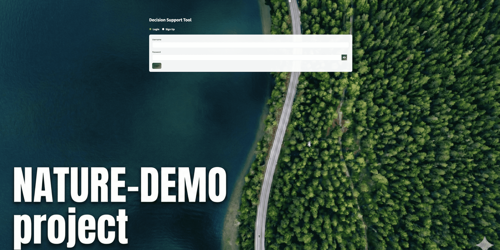
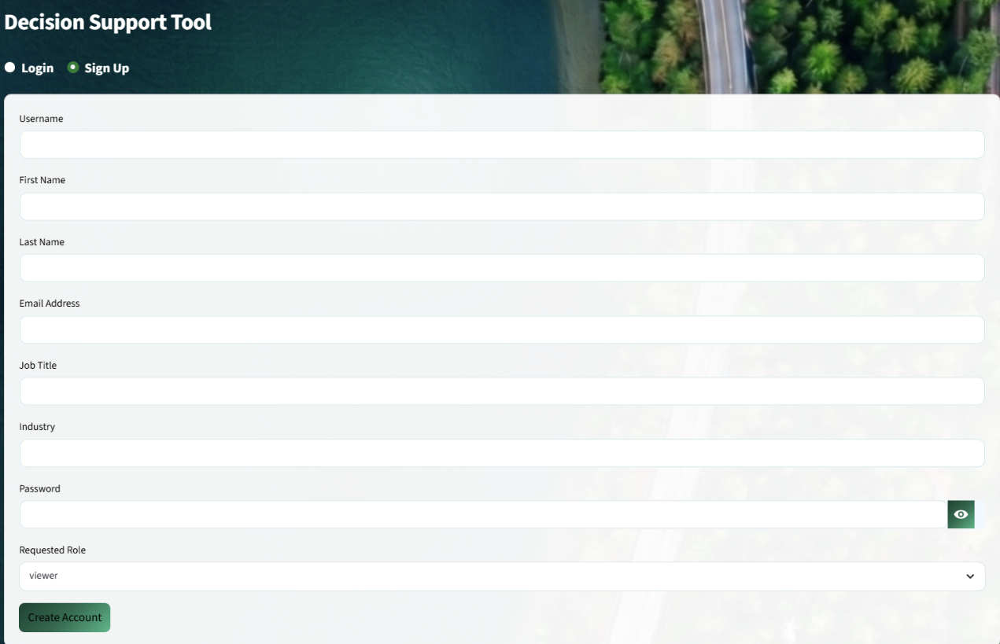

# Authentication and User Management

The High Resolution DST is access-controlled. A full-screen login wall is presented before any application content is rendered. Access is managed via a **Supabase PostgreSQL** database that stores bcrypt-hashed passwords, user profiles, approval status, and role assignments.

---

## Logging in

Navigate to [nature-demo-dst.dic-cloudmate.eu](https://nature-demo-dst.dic-cloudmate.eu). Select **Login**, enter your username and password, and click **Login**. On successful authentication a 7-day session cookie is set and the application loads.

- If your account is awaiting approval, the message *"Account waiting for Admin approval"* is shown. The account cannot be used until an administrator approves it.
- Incorrect credentials return *"Invalid username or password."* No automatic account lockout is applied.

---

## Creating a new account

Select **Sign Up** on the authentication screen. Complete all required fields: Username, First Name, Last Name, Email Address, Job Title, Industry, Requested Role, Password, and Confirm Password.

The **Requested Role** dropdown offers **viewer** or **expert** (see role descriptions below). The admin role cannot be self-assigned; it must be assigned by an existing administrator after account approval.

The password strength indicator must reach **Strong** before the *Create Account* button activates. A strong password requires at least 10 characters with at least one uppercase letter, one lowercase letter, one digit, and one special character.

After submission the account is created with pending approval status and cannot be used until an administrator processes the request.

---

## User roles

| Role | Permissions |
|------|-------------|
| **Viewer** | Read-only access — view consensus data, assessment results, and site content |
| **Expert** | All viewer permissions + submit personal KPI and NbS assessments that are averaged into the live consensus; save and load Level 1 / Level 2 analysis snapshots |
| **Admin** | All expert permissions + approve or reject user registrations, assign and change roles, delete accounts, and access the full expert-input audit trail |

---

## Changing your password

Once logged in, expand the **🔐 Change Password** section in the sidebar. Enter your current password, your new password (must reach Strong), and the confirmation, then click **Update Password**.

---

## Admin panel

Users with the admin role see a **🛡️ Admin Panel** expander in the sidebar containing three sections:

**⏳ Pending**  
Lists all registration requests awaiting approval. For each request the admin reviews the full name, email, job title, and industry, assigns a role using the dropdown, then clicks **Approve** or **Reject/Delete** followed by **Process**.

**📋 Audit**  
Displays the complete table of expert inputs from the Supabase database (`inputs_v3` table). A **📥 Download Audit CSV** button exports the full audit trail for reporting purposes.

**✅ Active Users**  
Table of all approved user accounts showing name and role, with a **Delete User** popover for account removal.
