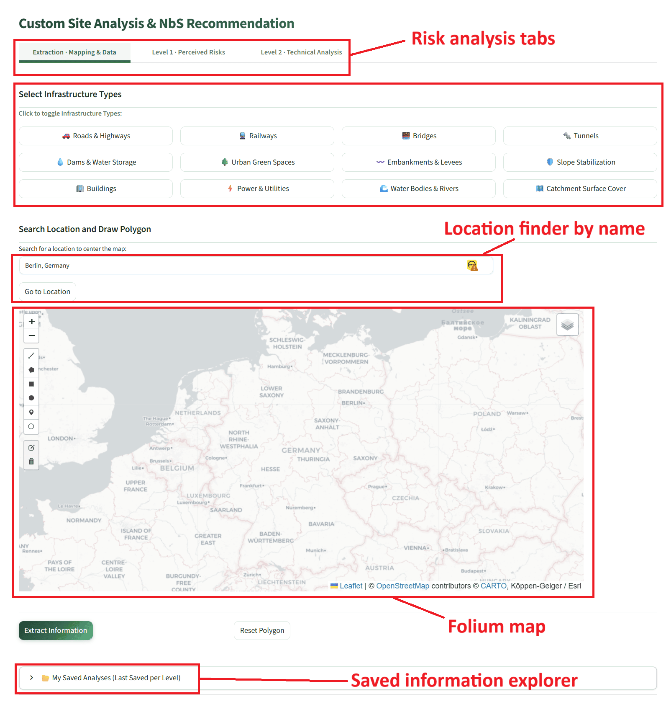
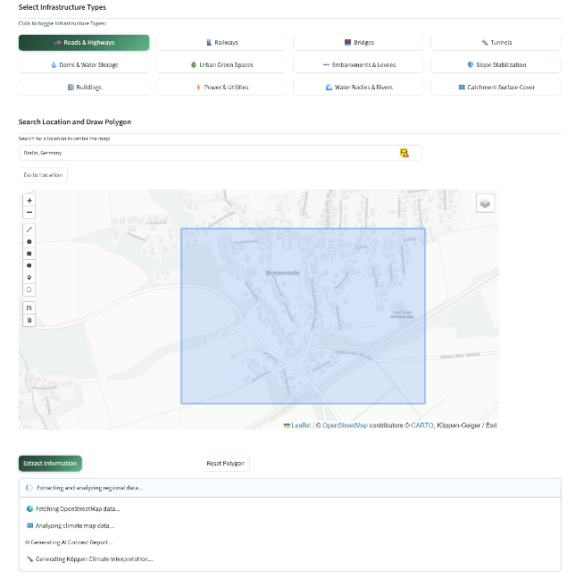
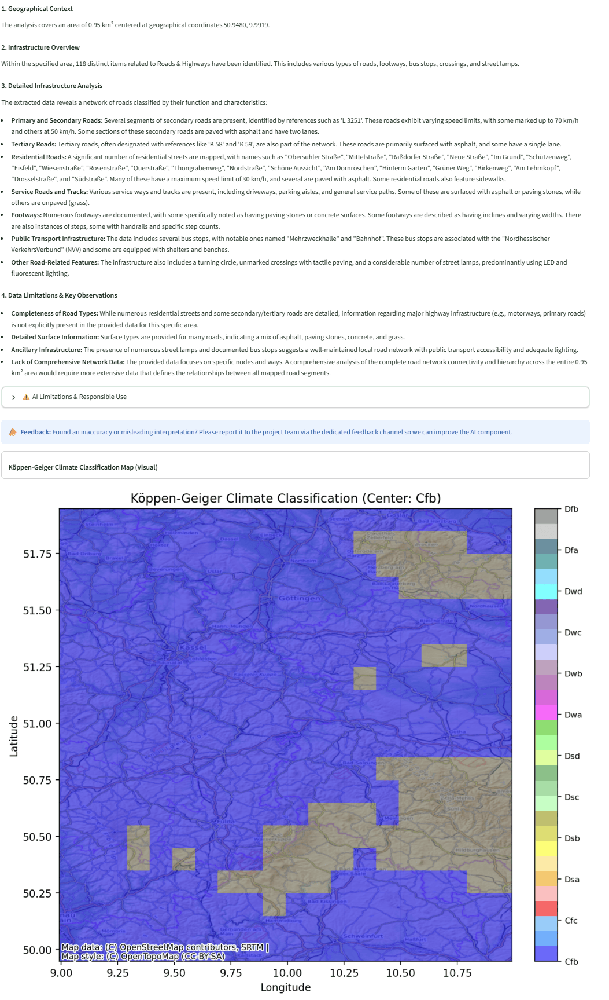

# Custom Site Analysis — Extraction

!!! note "Available in both tiers"
    The Custom Site Analysis workflow is exposed by both the General DST (public) and the Integrated DST (sign-up). Snapshot persistence to Supabase requires the Integrated tier.

The Custom Site Analysis is a free-form analysis tool applicable to any location across Europe, covering Levels 1 and 2 and including NbS scoring and ranking. The user defines the site by drawing a polygon on an interactive map.

Activate this mode by clicking the 🔬 **Custom Site Analysis & NbS Recommendation** button in the sidebar. The main content area shows three tabs.

!!! warning "Tab order matters"
    The Extraction tab must be completed first — it defines the polygon geometry and coordinates referenced by both the [Level 1](custom_level1.md) and [Level 2](custom_level2.md) save functions. The Custom Site Analysis was developed to facilitate exploratory data access using OpenStreetMap public data, complementing rather than replacing the structured T2.1 methodology applied in the [Specific Site DST](specific_site.md).

!!! note "AI-generated content on this page"
    The Extraction tab uses Google Gemini for the Geographical & Infrastructure Context Report and the Köppen-Geiger interpretation. See [AI-generated content & responsible use](../acknowledgments.md#ai-generated-content-and-responsible-use) for the project's AI-ethics policy.

The flow diagram below shows the complete end-to-end workflow of the Custom Site Analysis across all three tabs — Extraction, Level 1, and Level 2 — including all external API interactions.

---

## Extraction tab overview

The Extraction tab is the starting point for any custom site analysis. It performs three sequential operations: infrastructure type selection, geographic polygon definition, and data extraction from external sources.

---

## Section A — Select infrastructure types

Twelve chip-style toggle buttons are displayed in a 4-column grid. Each represents one infrastructure category. Clicking a chip selects it (button turns green); clicking again deselects it. Multiple chips can be selected simultaneously. The selection persists when switching between tabs within the Custom Site Analysis.

|  |  |  |  |
|--|--|--|--|
| 🚗 Roads & Highways | 🚆 Railways | 🌉 Bridges | 🔩 Tunnels |
| 💧 Dams & Water Storage | 🌳 Urban Green Spaces | 〰️ Embankments & Levees | 🛡️ Slope Stabilization |
| 🏢 Buildings | ⚡ Power & Utilities | 🌊 Water Bodies & Rivers | 🗺️ Catchment Surface Cover |

!!! warning "Selection limit"
    Selecting more than five infrastructure types simultaneously may cause the Overpass API query to exceed the server timeout limit. If a timeout occurs, reduce the number of selected types or draw a smaller polygon.

---

## Section B — Location search and map

A text input allows entering a place name (e.g., *"Innsbruck, Austria"*), which is geocoded via the Nominatim API. Clicking **Go** pans the Folium map to the matched location. The map provides:

- **CartoDB Positron base layer** — a clean light-grey streets map suitable for polygon drawing.
- **Köppen-Geiger Climate Classification tile overlay** (Esri ArcGIS) — togglable via the layer control icon in the top-right corner of the map.
- **Draw toolbar** (top-left corner) — contains Polygon and Rectangle drawing tools, an edit tool, and a trash/reset icon.

Polygon drawing workflow:

1. Use the location search box above the map to navigate to the target area, or pan and zoom manually.
2. Select the **Polygon** tool from the draw toolbar (top-left corner of the map).
3. Click on the map to place polygon vertices around the area of interest. Double-click on the last vertex to close the polygon.
4. Review the polygon boundary. If a mistake was made, use the trash icon in the draw toolbar to reset, then redraw.
5. Click the **Extract Information** button below the map to initiate the data extraction pipeline.

| Polygon drawing | Extracted information |
|---|---|
|  |  |

---

## Section C — Extraction results

### C1 — Geographical & Infrastructure Context Report

Once extraction is completed, the polygon coordinates and the selected infrastructure attributes retrieved from OpenStreetMap are passed to the Google Gemini model. The model generates a contextual infrastructure report using a retrieval-augmented generation (RAG) approach with embedded examples — no external internet search is performed, in accordance with the project AI-ethics requirements. The report is displayed inside a yellow-bordered AI-Generated Content panel, which includes:

- the Gemini model version identifier,
- an inline summary of feature counts per infrastructure category,
- the full AI narrative text, and
- a collapsible ⚠️ AI Limitations & Responsible Use expander.

A feedback notice at the bottom of every AI output asks users to report any inaccuracies. The raw OSM data that was provided to the model is accessible via a **View Raw Data Fed to AI** expander, allowing users to independently verify the basis of the AI interpretation.

### C2 — Köppen-Geiger Climate Classification map

The Köppen-Geiger raster (1991–2020) is sampled at the centroid of the drawn polygon. The identified climate code (e.g., *"Cfb"*) and the raster tile covering the surrounding region (±1° range) are rendered as a matplotlib figure over an OpenTopoMap basemap. A climate interpretation report is then generated by Gemini, presented with the same AI disclaimer structure. The **View Raw Data Fed to AI** expander reveals the exact climate code string passed to the model.

### C3 — Raw OSM data tables

A **View Extracted Infrastructure Data Tables (OpenStreetMap Raw Data)** expander at the bottom of the extraction results contains sub-tables for each selected infrastructure type, showing up to 20 OSM features with all available tag attributes. Geometry columns are excluded from the display. These tables allow users to directly inspect and verify the source data underlying the AI report.

---

## Saved analyses panel

Expert and admin users also see a **📂 My Saved Analyses (Last Saved per Level)** expander listing previously saved Level 1 and Level 2 snapshots with load and delete controls. See [Exporting results](exporting.md) for details on saving, loading, and managing snapshots.
