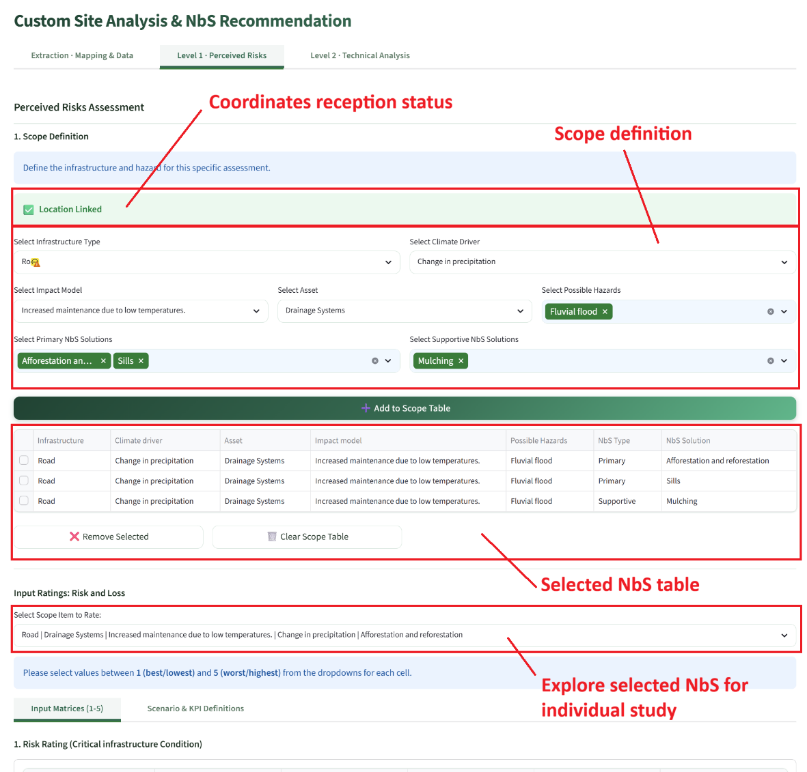
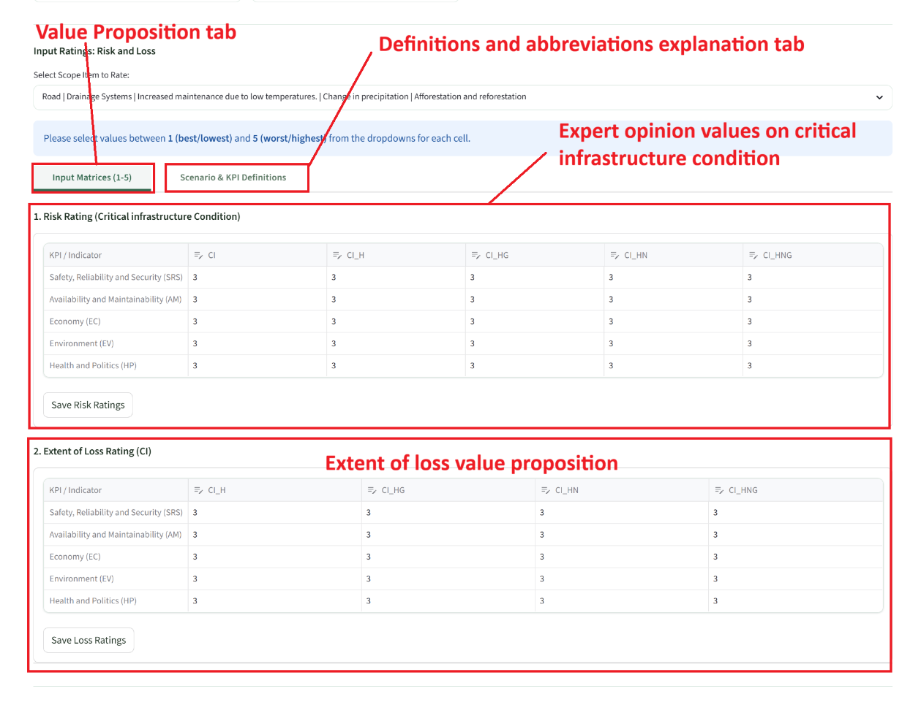
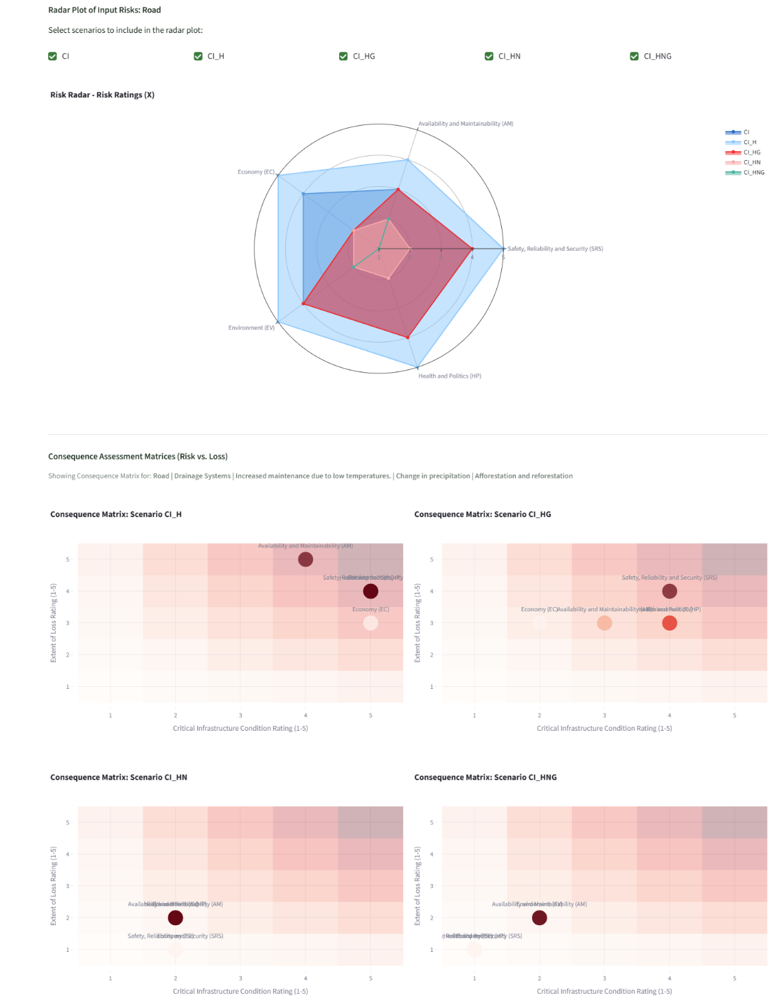
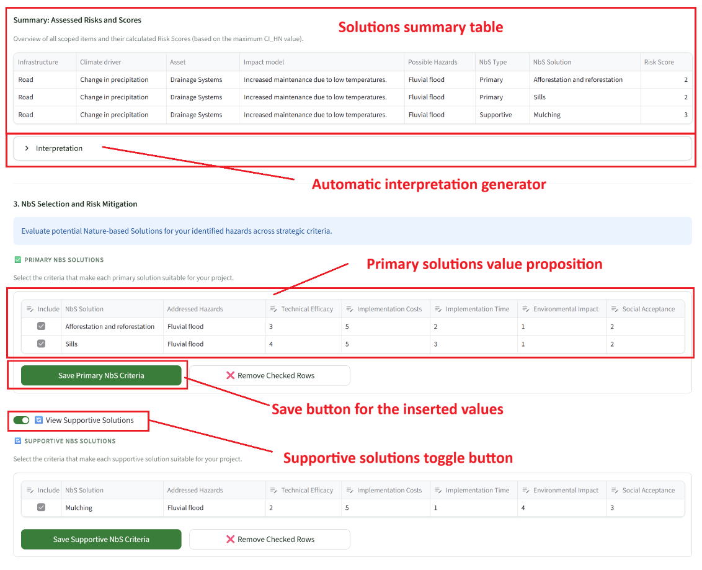
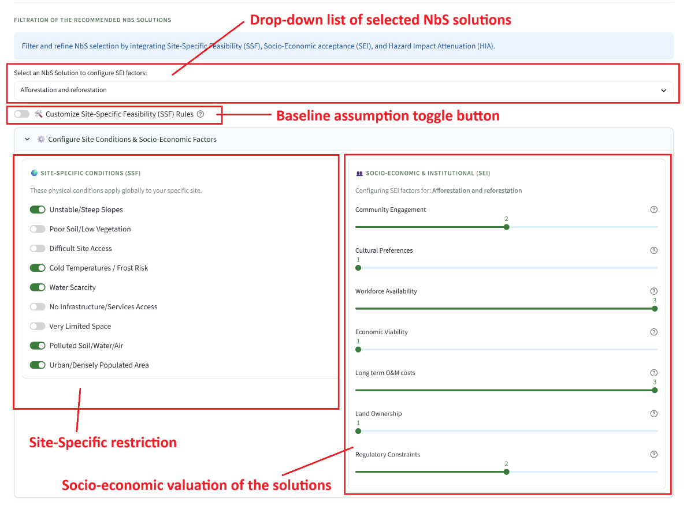
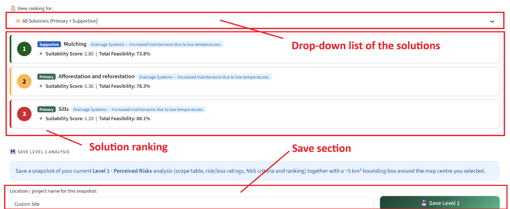

# Custom Site Analysis — Level 1: Perceived Risk

Level 1 is a structured expert-driven perceived risk assessment. The workflow is divided into three sequential sections: defining the scope, rating risk and loss, and evaluating NbS solutions. For the methodological background see [Level 1 — Qualitative assessment](../methodology/level1_qualitative.md).

!!! warning "Prerequisite"
    Complete the [Extraction tab](custom_extraction.md) first. The polygon's centre coordinates are referenced when saving Level 1 snapshots.

!!! note "AI-generated content on this page"
    Section 2 includes an optional **Generate Interpretation Report** that calls Google Gemini. See [AI-generated content & responsible use](../acknowledgments.md#ai-generated-content-and-responsible-use).

---

## Section 1 — Scope table definition

The scope table defines the set of infrastructure–hazard–NbS combinations to be assessed. If a polygon was drawn in the Extraction tab, its centre coordinates are transferred automatically and a **"Location Linked ✅"** message is shown at the top of this section.

Five cascaded selectors define each row to be added to the scope table:

1. **Infrastructure Type** — from the twelve chip button infrastructure categories.
2. **Climate Driver** — the overarching climate forcing (e.g., *"Change in precipitation"*, *"Air surface temperature increase"*).
3. **Impact Model** — automatically filtered by the selected infrastructure type; populated from the `modules/impact_models/` registry.
4. **Asset** — automatically filtered by the selected infrastructure type.
5. **Possible Hazards** — multi-select from the canonical list of 29 specific hazard types (e.g., *"Fluvial flood"*, *"Debris flow"*, *"Landslides < 2 m depth"*).

After hazards are selected, two additional multi-select fields appear, populated automatically from the `modules/nbs/` hazard–NbS matrix:

- **Primary NbS Solutions** — solutions that directly address the selected hazards (tagged *"Yes"* in the hazard matrix).
- **Supportive NbS Solutions** — solutions that provide indirect risk reduction or co-benefits (tagged *"Supportive"* in the hazard matrix).

Click ➕ **Add to Scope Table** to append the selected combination. Each selected NbS creates a separate row in the table. Use the row checkboxes and ❌ **Remove Selected** button to delete individual rows, or 🗑️ **Clear Scope Table** to reset entirely.

---

## Section 2 — Risk rating and Extent of Loss

Once the scope table contains at least one row, a **Select Scope Item to Rate** dropdown appears. Selecting an item reveals two tabs below: **Input Matrices (1–5)** and **Scenario & KPI Definitions**. It is strongly recommended to read the Scenario & KPI Definitions tab before entering any values.

### Risk rating (CI Condition table)

A data editor table presents 5 KPI rows (SRS, AM, EC, EV, HP) × 5 scenario columns (CI, CI_H, CI_HG, CI_HN, CI_HNG). To change a value, double-click the cell to reveal a dropdown with options 1 (best condition) through 5 (worst condition), or *"Not Available"*. After editing all required cells, click **Save Risk Ratings**. The system automatically calculates the **Risk Score** for the scope item as the maximum CI_HN value across all five KPIs.

### Extent of Loss rating

A second data editor presents 5 KPI rows × 4 scenario columns (CI is excluded — there is no loss in the absence of a hazard). Values 1–5. Click **Save Loss Ratings** to commit. After saving, the radar chart and consequence matrices update automatically.

A **Summary** table at the bottom of this section lists all scope items with their calculated Risk Scores, providing an at-a-glance comparison across the full scope of the assessment.

An **Interpretation** expander below the summary table contains a **Generate Interpretation Report** button. Clicking it sends the current risk and loss matrices to Gemini, which produces a narrative analysis of the findings. The report is delivered with the standard AI disclaimer banner and limitations expander.

---

## Section 3 — NbS solution rating

This section allows the assessor to rate the identified NbS solutions against a set of implementation criteria. For each primary NbS solution in the scope table, the following five criteria must be rated on a scale of 1 to 5, or marked as *"Not Acceptable"*:

| Criterion | Description |
|-----------|-------------|
| **Technical Efficiency** | The expected technical effectiveness of the solution in reducing the hazard impact |
| **Implementation Cost** | The estimated capital cost relative to alternatives |
| **Implementation Time** | The expected time to deploy the solution and achieve risk reduction |
| **Environmental Impact** | The net environmental effect of implementing the solution |
| **Social Acceptance** | The anticipated degree of acceptance by affected communities and stakeholders |

Double-click any cell in the rating table to access the value dropdown. Click **Save** after entering all values. To also rate supportive NbS solutions, activate the **View Supportive Solutions** toggle button to reveal a separate rating table for those solutions.

### NbS filtration — Site-Specific and Socio-Economic factors

The **Filtration of the Recommended NbS Solutions** section refines the NbS ranking through three layers of assessment:

- **Site-Specific Feasibility (SSF)** — nine toggle buttons representing physical site conditions that may constrain NbS implementation (e.g., *Unstable/Steep Slopes*, *Cold Temperatures*, *Space Constraints*, *High flood frequency*, *Poor soil*, *Low water availability*, *Dense urban setting*, etc.). Enabling a condition reduces the feasibility score of NbS solutions that are sensitive to that constraint. The baseline feasibility assumptions can be reviewed and customised by activating the **Custom Site-Specific Feasibility (SSF) Rules** toggle, which reveals an editable assumption table.

- **Socio-Economic & Institutional (SEI)** — for the solution selected in the **Select an NbS Solution to configure SEI factors** dropdown, seven slider controls allow rating *Community Engagement*, *Cultural Preferences*, *Workforce Availability*, *Economic Viability*, *Long-term O&M Costs*, *Land Ownership*, and *Regulatory Constraints*. Each slider uses the scale: 1 = Favorable, 2 = Neutral, 3 = Unfavorable.

A **feasibility spider diagram** is automatically generated for each solution based on the SSF and SEI configuration, visualising the solution's performance across all assessment dimensions. This diagram is accessible in the **View Full Site-Specific Filtration Summary** expander.

Once the filtration is configured, the **Final NbS Recommendation Strategy** table displays the risk score, suitability index, and suitability score for every solution. The **Ranked NbS Solutions by Suitability Score** section presents solutions in descending order of overall suitability, with a dropdown allowing the view to be filtered to primary solutions only, supportive solutions only, or all solutions combined.

---

## Saving a Level 1 snapshot

Expert and admin users can persist the complete Level 1 analysis state as a named snapshot. Enter a descriptive location name in the text field at the bottom of the Level 1 tab and click 💾 **Save Level 1**. See [Exporting results](exporting.md) for details on snapshot contents, loading, and deletion.

!!! warning "Polygon required"
    A polygon must have been drawn in the Extraction tab before saving. If no polygon exists, the save is blocked and a warning message is displayed.
