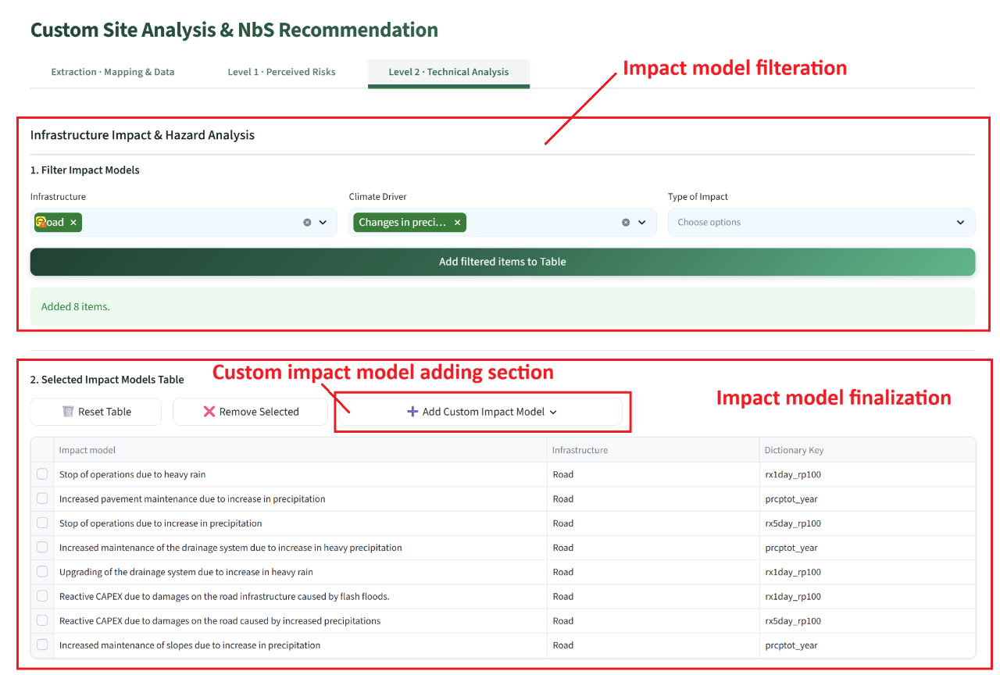
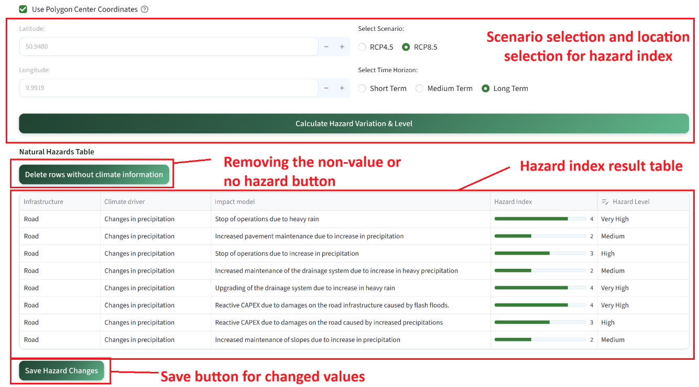
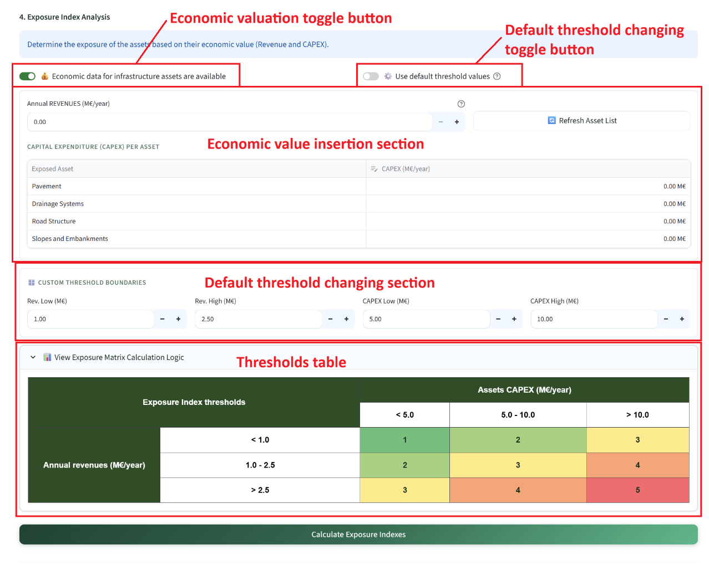
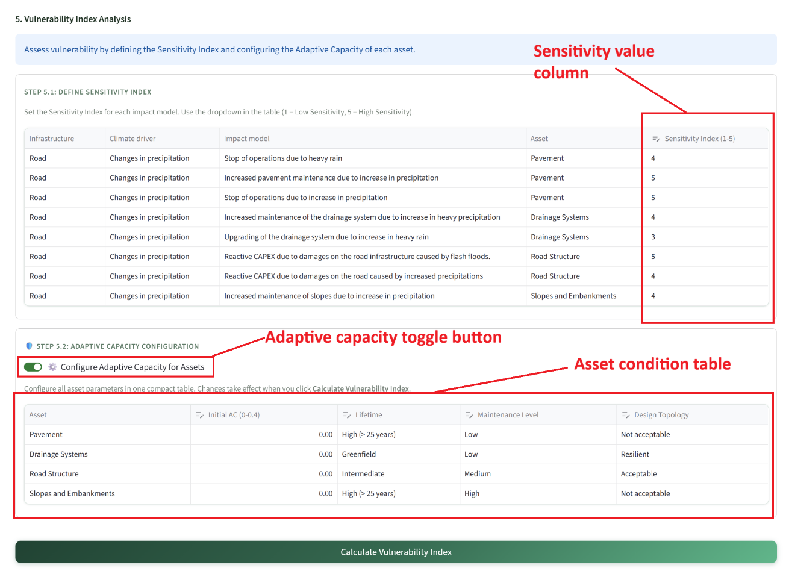
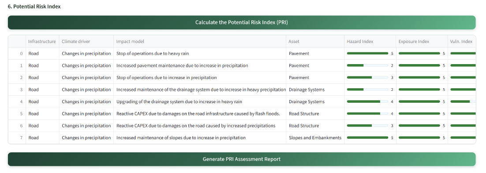
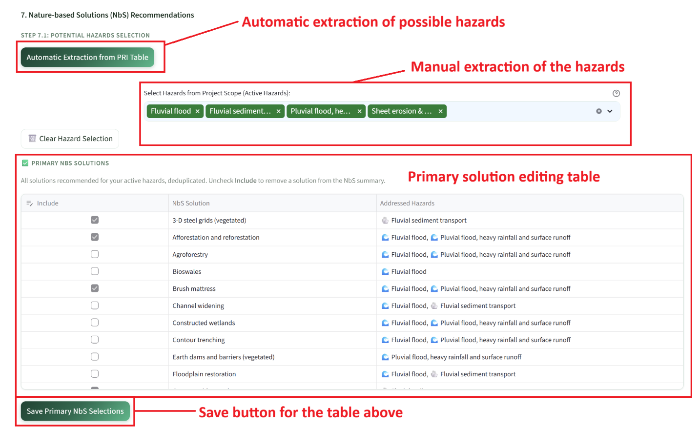
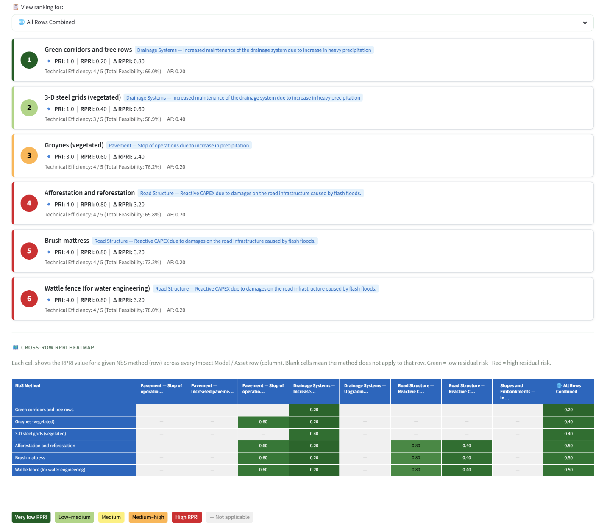

# Custom Site Analysis — Level 2: Technical Analysis

Level 2 is a sequential quantitative risk assessment workflow consisting of seven numbered steps. Each step builds on the results of the previous one. Steps must be completed in order. The four risk indices — Hazard Index (HI), Exposure Index (EI), Vulnerability Index (VI), and Potential Risk Index (PRI) — are computed progressively and combined in Step 6. For the methodological background see [Level 2 — Semi-quantitative pre-screening](../methodology/level2_prescreening.md).

!!! warning "Prerequisite"
    Complete the [Extraction tab](custom_extraction.md) first. The polygon's centre coordinates feed Step 3 (Hazard Index retrieval) and the Level 2 save function.

!!! note "AI-generated content on this page"
    Step 6 includes an optional **Generate PRI Assessment Report** that calls Google Gemini. See [AI-generated content & responsible use](../acknowledgments.md#ai-generated-content-and-responsible-use).

---

## Step 1 — Filter and add impact models

Three cascaded multiselect dropdowns — **Infrastructure**, **Climate Driver**, and **Type of Impact** — progressively filter the impact model database (sourced from `modules/impact_models/`). Each selection narrows the available options in the next field. Click **Add filtered items to Table** to append the matching rows to the working impact models table. This process can be repeated with different filter combinations to build a comprehensive scope covering multiple infrastructure types and climate drivers.

---

## Step 2 — Review and customise the impact models table

The accumulated impact model rows are displayed in an interactive table. Individual rows can be removed by selecting the checkbox at the start of each row and clicking the delete control. Two additional controls are available above the table:

- 🗑️ **Reset Table** — clears all rows and resets all downstream calculations.
- ➕ **Add Custom Impact Model** — opens a popover allowing manual definition of a custom impact model. The user specifies the infrastructure type, climate driver, impact description (free text), specific asset name, and the EURO-CORDEX climate indicator to be used. The hazard types must also be specified, as they are essential for all subsequent risk calculations. Custom entries are flagged in the table for AI transparency.

---

## Step 3 — Hazard Index: climate data configuration

This step quantifies the climate hazard using IBM's EURO-CORDEX climate indicator API. For each row in the impact models table, a climate indicator has been assigned based on the impact model definition. Step 3 retrieves the indicator values for the selected location under the chosen climate scenario and time horizon.

The following inputs must be provided before calculation:

- **Location coordinates** — either entered manually or transferred automatically from the Extraction tab by activating the **Use Polygon Center Coordinates** checkbox.
- **Climate scenario** — selected via radio buttons: RCP4.5 (moderate emissions) or RCP8.5 (high emissions).
- **Time horizon** — selected via radio buttons: Short-term (2011–2040), Medium-term (2041–2070), or Long-term (2071–2100).

Click **Calculate Hazard Variation & Level** to send the location coordinates and the required climate indicator codes to the IBM API. The returned indicator values are displayed in the table as the **Hazard Level** for each row. If any rows return no climate data (e.g., the indicator is not available for the location), the **Delete rows without climate information** button removes them automatically. Users with pre-existing hazard level data may override the API values by double-clicking the Hazard Level cell and selecting from the dropdown; such changes must be committed using the **Save Hazard Changes** button.

---

## Step 4 — Exposure Index

The **Exposure Index (EI, 1–5)** quantifies the degree to which the infrastructure asset is financially and physically exposed to the hazard.

If detailed economic valuation data are not available, a default EI value of 3 can be assigned to all rows by clicking **Calculate Exposure Index** without further configuration. This provides a conservative, neutral baseline for the subsequent risk calculations.

If economic data are available, activate the **Economic data for infrastructure assets are available** toggle. This reveals two input panels for each unique asset in the impact models table:

- **Annual revenue** — the total annual economic throughput or revenue attributable to the asset, entered in million Euros.
- **CAPEX** — the capital replacement value of the specific asset, entered in million Euros. Assets not relevant to the assessment can be left empty; assets not listed can be approximated using the **Other assets** field.

Default threshold values for CAPEX and revenue brackets are used internally to classify exposure. To override these thresholds, deactivate the **Use default threshold values** toggle to reveal the **Custom Threshold Boundaries** configuration panel. The **View Exposure Matrix Calculation Logic** expander displays how the configured thresholds translate to EI scores.

---

## Step 5 — Vulnerability Index

### Step 5.1 — Sensitivity Index

A data editor table allows setting the **Sensitivity Index (1–5)** for each row in the impact models table. 1 = Low Sensitivity (the infrastructure withstands the hazard well), 5 = High Sensitivity (the infrastructure is highly susceptible to damage). All other columns in the table are read-only at this stage.

### Step 5.2 — Adaptive Capacity configuration (optional)

Activate the **Configure Adaptive Capacity for Assets** toggle to reveal the adaptive capacity configuration table. For each unique asset identified in the impact models table, four parameters can be adjusted:

| Parameter | Options | Effect on AC |
|-----------|---------|--------------|
| **Initial AC₀** | 0.0 – 0.4 | Baseline value |
| **Lifetime** | Greenfield / Intermediate / High > 25 years | +0.10 / 0 / −0.10 |
| **Maintenance Level** | High / Medium / Low | +0.10 / 0 / −0.10 |
| **Design Topology** | Resilient / Acceptable / Not acceptable | +0.10 / 0 / −0.10 |

The final Adaptive Capacity is calculated as `AC = AC₀ + (Lifetime + Maintenance + Topology) / 100`, capped at 0.4. The Vulnerability Index is then computed as:

$$\text{VI} = \text{Sensitivity} \times (1 - \text{AC})$$

Click **Calculate Vulnerability Index** to run the calculation and update the results table.

---

## Step 6 — Potential Risk Index (PRI)

Once HI, EI, and VI have been calculated for all rows, click **Calculate the Potential Risk Index (PRI)**. The PRI is computed as the product `HI × EI × VI`, and the result is mapped to the nearest threshold in the following lookup table:

| HI × EI × VI product | PRI score | Risk label |
|----------------------|-----------|------------|
| 0 | 0 | NO RISK |
| ≤ 25 | 1 | VERY LOW |
| ≤ 50 | 2 | LOW |
| ≤ 75 | 3 | MEDIUM |
| ≤ 100 | 4 | HIGH |
| ≥ 125 | 5 | EXTREME |

PRI scores and labels are added as new columns to the results table. A **Generate PRI Assessment Report** button in this section sends the PRI results to Gemini, which produces a structured narrative report on the risk profile using embedded examples and a RAG approach, consistent with the project AI-ethics requirements.

---

## Step 7 — NbS implementation and ranking

### Step 7.1 — NbS solution identification

This step identifies the applicable NbS solutions for each row in the impact models table, based on the hazard types associated with each impact model. Two methods are available for hazard identification:

- **Automatic Extraction from PRI Table** — the application applies a built-in dictionary that maps impact model entries to their most likely specific hazard types. This method is convenient but may not capture all relevant hazards for ambiguous impact models; users should review and supplement the automatically extracted hazards.
- **Manual Selection** — a multi-select list allows the user to explicitly specify the hazard types of interest, providing complete control over the NbS matching.

Once hazards are selected, the primary NbS solutions associated with those hazards are displayed in the **Primary NbS Solutions** table. Each row includes a checkbox at the start, allowing the user to deselect solutions that are not relevant to the specific site context. Click **Save Primary NbS Selections** to confirm the selection. Supportive NbS solutions can be added by activating the **Configure Supportive NbS Solutions** toggle button, which reveals an equivalent table for supportive solutions.

The **NbS Implementation Mapping Summary** table at the end of Step 7.1 displays the final confirmed Primary and Supportive NbS solutions for each impact model row.

### Step 7.2 — NbS filtration and ranking

Step 7.2 applies three layers of site-specific and socio-economic filtering to refine and rank the confirmed NbS candidates, using the same SSF and SEI framework as [Level 1 Section 3](custom_level1.md#nbs-filtration-site-specific-and-socio-economic-factors). Configure the nine SSF toggle conditions and the seven SEI sliders for each solution, then click **Calculate RPRI Ranking** to compute the **Residual Potential Risk Index (RPRI)** for each solution.

The RPRI represents the remaining level of risk after the NbS solution has been implemented. A RPRI of 0 indicates complete risk elimination; higher values indicate residual risk. Solutions are ranked in ascending order of RPRI, with colour coding that reflects the remaining risk level.

The ranked NbS solutions are displayed as a series of color-coded cards, each showing the rank position, solution name, type (Primary or Supportive), and RPRI score. A view selector dropdown above the cards filters the list to All Solutions, Primary only, Supportive only, or by individual scope row. A **cross-row RPRI heat map table** summarises the effectiveness of all shortlisted NbS solutions across all impact model rows simultaneously, using a dark-green-to-red colour scale where green cells indicate the solution substantially reduces risk and red cells indicate insufficient reduction.

---

## Saving a Level 2 snapshot

Expert and admin users can persist the complete Level 2 analysis state — impact models table, hazard configuration, EI/VI parameters, PRI results, NbS mappings, and SSF/SEI configuration — as a named JSON snapshot. Enter a descriptive location name in the text field at the bottom of the Level 2 tab and click 💾 **Save Level 2**. See [Exporting results](exporting.md) for details on snapshot contents, loading, and deletion.
