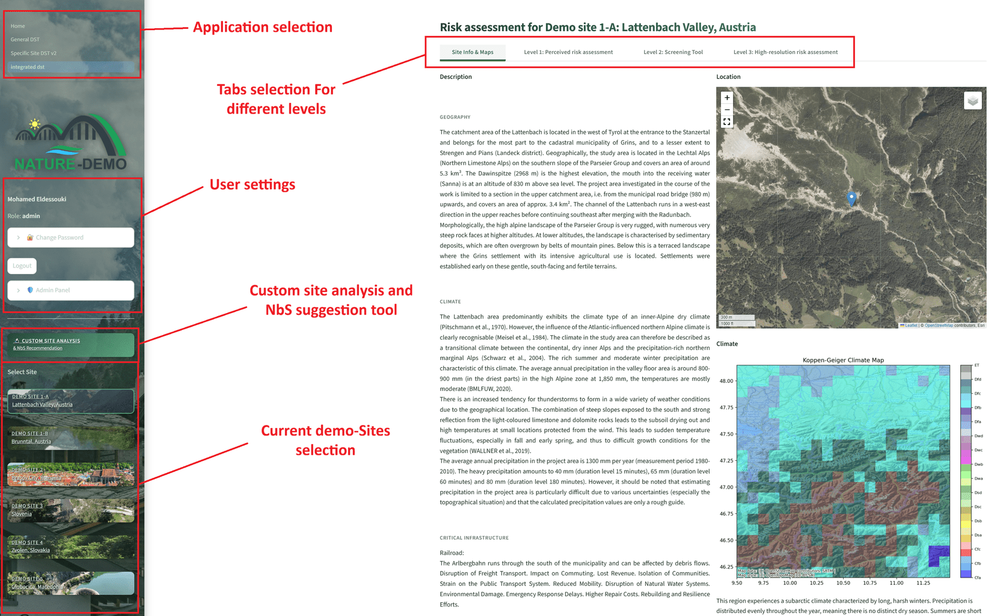
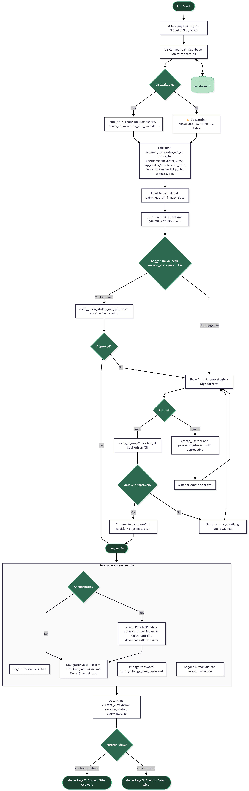

# Application layout

This page describes the layout of the **High Resolution DST**. The public Decision Support Tool has its own sidebar with cross-links to the High Resolution DST and to the Climate Data Visualisation companion tool, and no authentication or admin-panel elements.

The application presents a persistent sidebar on the left and a dynamic main content area on the right. Unauthenticated users land on the Custom Site Analysis workflow directly and can complete a full assessment without logging in; an account is required only to save analyses or access demonstrator-site content.

---

## The sidebar

The sidebar uses a dark-green nature-themed background and is structured top to bottom:

- NATURE-DEMO project logo
- **Guest notice** (when not logged in) — a brief banner indicating guest mode, with **Login** and **Sign Up** links that open the authentication screen
- **User profile** (when logged in) — display name and role (e.g., *"Jane Smith — Role: expert"*), 🔐 **Change Password** expander, **Logout** button, and 🛡️ **Admin Panel** expander (admin users only)
- 🔬 **Custom Site Analysis & NbS Recommendation** button — switches the main content area to the [Custom Site Analysis](custom_extraction.md) mode
- **Select Site** section — six clickable site cards covering the five NATURE-DEMO demonstration sites (the Austrian demonstrator is split into two sub-sites). Each card displays a background photograph, the site label in bold, and the location name. The currently active card is highlighted with a green border.

---

## The main content area

The main area renders one of two view types based on the sidebar selection:

- **[Demonstrator-site view](specific_site.md)** — activated when a demo site card is clicked. A page title (e.g., *"Risk assessment for Demo site 1-A: Lattenbach Valley, Austria"*) is followed by a four-tab interface: Site Info & Maps, Level 1, Level 2, Level 3.
- **Custom Site Analysis view** — activated by the 🔬 button. The page title *"Custom Site Analysis & NbS Recommendation"* is followed by a three-tab interface: [Extraction · Mapping & Data](custom_extraction.md), [Level 1 · Perceived Risks](custom_level1.md), and [Level 2 · Technical Analysis](custom_level2.md).

---

## Application startup and routing

The flow diagram below shows the complete application startup and authentication flow — from the initial database connection check, through user login and role validation, to sidebar rendering and routing between the two analysis modes.

