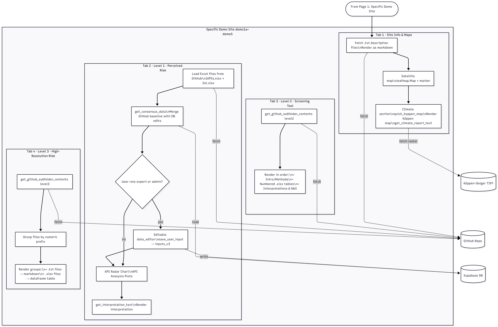
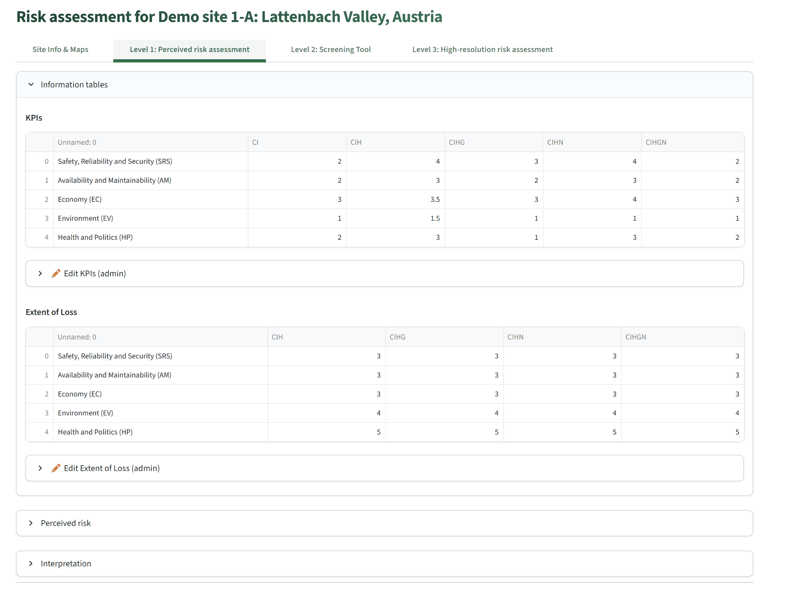
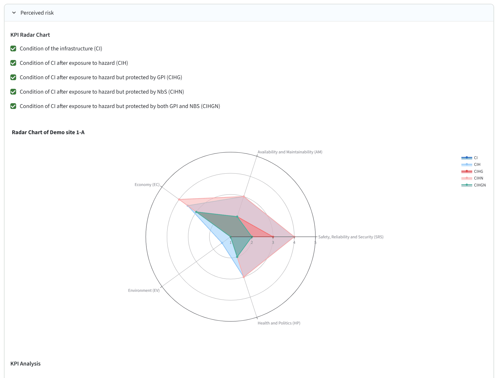
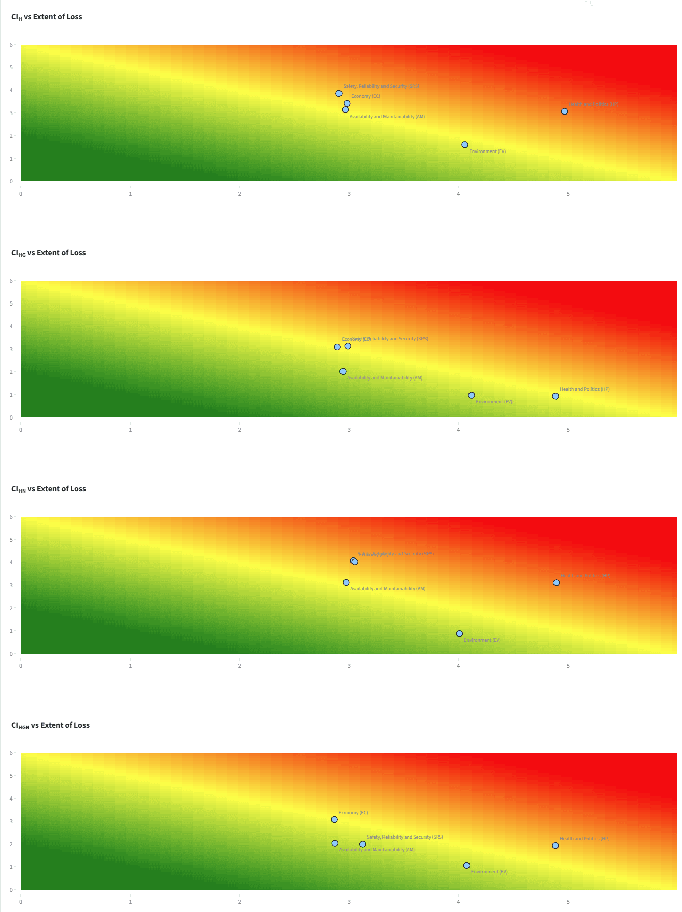
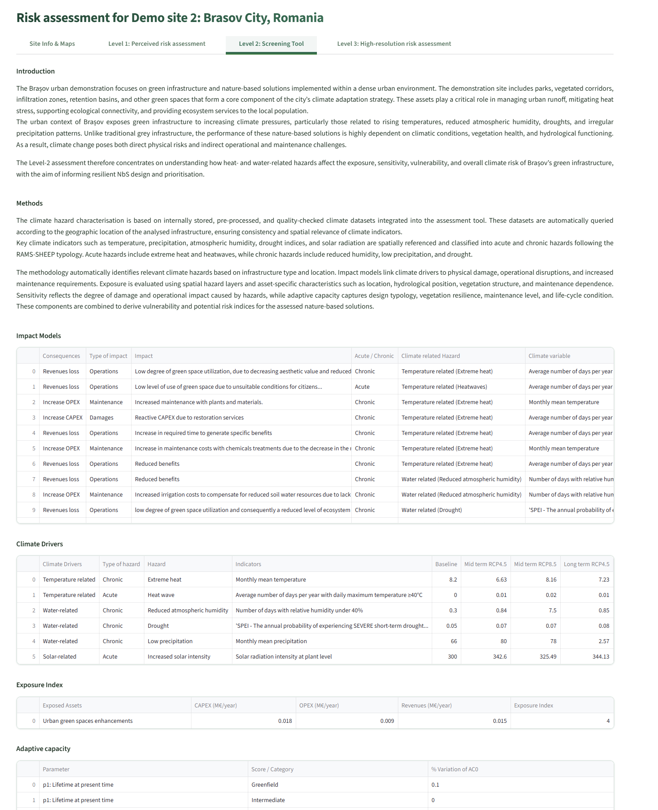
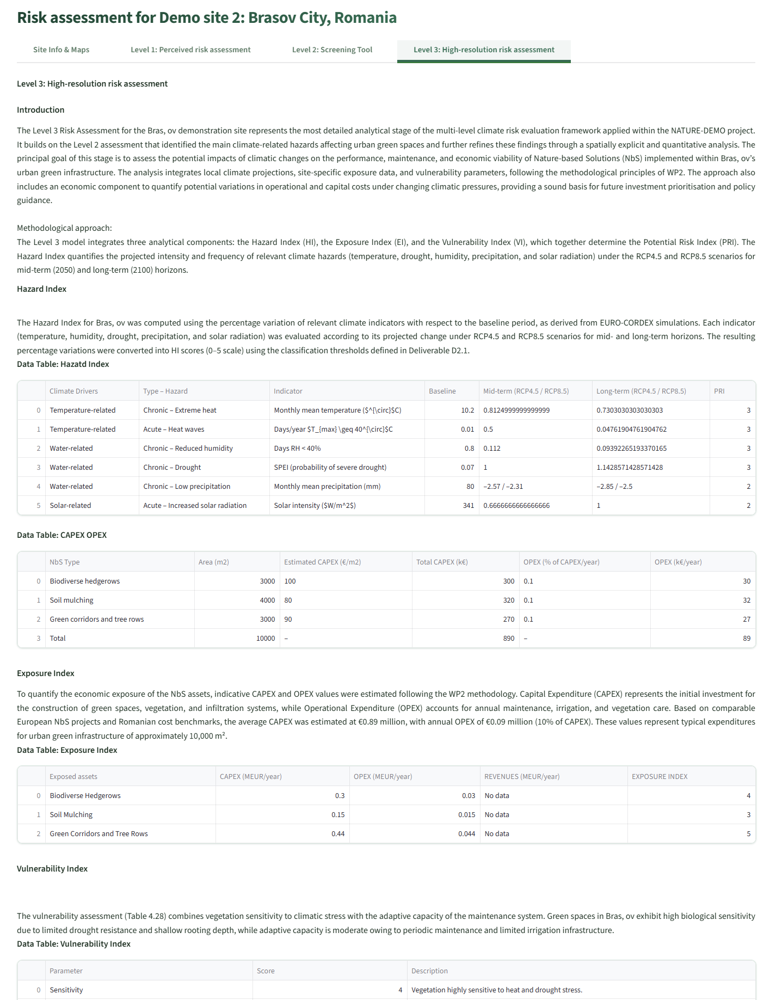

# Specific Site DST

!!! note "Integrated DST only"
    The Specific Site mode is part of the Integrated DST tier (sign-up required). The General DST tier exposes only the Custom Site Analysis workflow.

The **Specific Site DST** is a pre-configured assessment environment for the six NATURE-DEMO demonstration site configurations, covering all three levels of risk assessment (Level 1: Perceived Risk, Level 2: Screening Tool, Level 3: High-Resolution Assessment). All site data is loaded automatically from the project GitHub repository at runtime — no static content is bundled in the deployed application.

Clicking a site card in the sidebar loads the Specific Site view and opens a four-tab interface.

!!! note "AI-generated content on this page"
    Several Specific Site features call Google Gemini for narrative interpretation. See [AI-generated content & responsible use](../acknowledgments.md#ai-generated-content-and-responsible-use) for the project's AI-ethics policy.

---

## Demonstration sites

Six pre-configured site configurations are available, covering five NATURE-DEMO demonstration sites. The Austrian demonstrator is split into two sub-sites reflecting distinct locations within the same catchment.

| Site | Location | Country | Primary CI / hazard focus |
|------|----------|---------|---------------------------|
| Demo 1-A | Lattenbach Valley | Austria | Torrent control / railway — debris flows, extreme rainfall, slope instability |
| Demo 1-B | Brunntal | Austria | Alpine roads and paths — slope stability, snowmelt floods |
| Demo 2 | Brașov (Propark) | Romania | Urban green infrastructure — heat island, drought, air pollution |
| Demo 3 | Ljubljana | Slovenia | River / flood protection — fluvial flooding, river erosion |
| Demo 4 | Zvolen | Slovakia | Road and railway crossroads — wildfire, flooding, extreme weather |
| Demo 5 | Globocica / Shpilje | N. Macedonia | Hydropower dams — drought, sedimentation, water resource stress |

Each site maps to a GitHub directory key (`demo1a`, `demo1b`, `demo2`, `demo3`, `demo4`, `demo5`) used to fetch all content files at runtime via the GitHub Contents API.

---

## Tab 1 — Site Info & Maps

The tab is divided into a **left column** (site description) and a **right column** (interactive map and climate data).

### Left column — site description

Text files stored in the repository under `texts/{site_key}/` are fetched and sorted by their numeric filename prefix. The prefix is stripped and the remainder of the filename becomes the section heading. Content is rendered as justified paragraphs. New description sections can be added by uploading a correctly named `.txt` file to the GitHub repository — no code changes required.

### Right column — interactive map

A Leafmap satellite-imagery map is rendered centred on the site's reference coordinates at zoom level 15. A location marker pinpoints the exact site location. Users can pan and zoom the map interactively.

### Right column — Köppen-Geiger climate map and report

The Köppen-Geiger Climate Classification raster (1991–2020 baseline, 0.1° resolution) is sampled at the site coordinates and rendered as a static map over an OpenTopoMap basemap using matplotlib and contextily. The identified climate class (e.g., Cfb — Temperate oceanic) is highlighted in the 30-class colour bar. A pre-written climate report file, stored in GitHub, is displayed below the map.

---

## Tab 2 — Level 1: Perceived Risk

### Consensus data system

When this tab opens, two Excel files are downloaded from GitHub for the active site: the **KPI condition table** (5 KPIs × 5 scenarios) and the **Extent of Loss table** (5 KPIs × 4 scenarios). If expert users have previously submitted their own values, all submissions — including the GitHub baseline — are averaged into a live consensus displayed to all users. Administrator submissions overrule the consensus directly rather than contributing to the average.

### The five Key Performance Indicators

All Level 1 assessments use the following five standardized KPIs (see [Level 1 methodology](../methodology/level1_qualitative.md) for full definitions):

- **SRS** — Safety, Reliability, and Security
- **AM** — Availability and Maintainability
- **EC** — Economy
- **EV** — Environment
- **HP** — Health and Politics

### Information tables expander

Expanded by default, this section shows the KPI consensus table and the Extent of Loss consensus table. Expert and admin users see an additional ✏️ Edit form below each table, pre-populated with their own previously saved values (or the GitHub baseline if no personal values exist yet). After editing any cell, click **Save** to commit the values to the database via UPSERT. The page reruns automatically to incorporate the updated values into the consensus.

### Perceived Risk expander — radar chart and consequence matrices

This expander contains two visual output blocks. The **KPI Radar Chart** is a Plotly radar chart with five axes (one per KPI). Per-scenario toggle checkboxes above the chart (CI, CI_H, CI_HG, CI_HN, CI_HNG) control which scenario polygons are displayed. The charts update dynamically when new values are saved.

Below the radar chart, up to four **consequence matrices** are plotted. Each is a Plotly scatter heat map for one scenario, plotting CI condition (y-axis) against Extent of Loss (x-axis) for the five KPIs, overlaid on a red-green severity background. Darker red cells indicate higher combined risk.

| KPI Radar Chart | Consequence matrices |
|---|---|
|  |  |

### Interpretation expander

A pre-written interpretation text is fetched from GitHub and rendered in this expander. It provides a non-technical narrative explanation of the KPI values and their implications, accessible to readers who are not experts in risk assessment methodology.

---

## Tab 3 — Level 2: Screening Tool

This tab dynamically loads files from the `texts/{site_key}/level2/` subdirectory on GitHub, rendering them in the following fixed order:

1. `Introduction.txt` — context and scope narrative
2. `Methods.txt` — methodology notes specific to the site
3. Numbered `.xlsx` files (each rendered as an interactive sortable data table)
4. `Interpretations.txt` — narrative interpretation of the results
5. `NbS.txt` — NbS recommendations for the site

Absent files are silently skipped. Adding content to any site requires only uploading a correctly named file to GitHub.

---

## Tab 4 — Level 3: High-Resolution Risk Assessment

Level 3 files are loaded from `texts/{site_key}/level3/`. Files are grouped by their numeric prefix — within each group, `.txt` files render first as section headings with justified text, followed by `.xlsx` files as interactive tables. If no Level 3 files are present for a site, the message *"No Level 3 data found."* is displayed.

